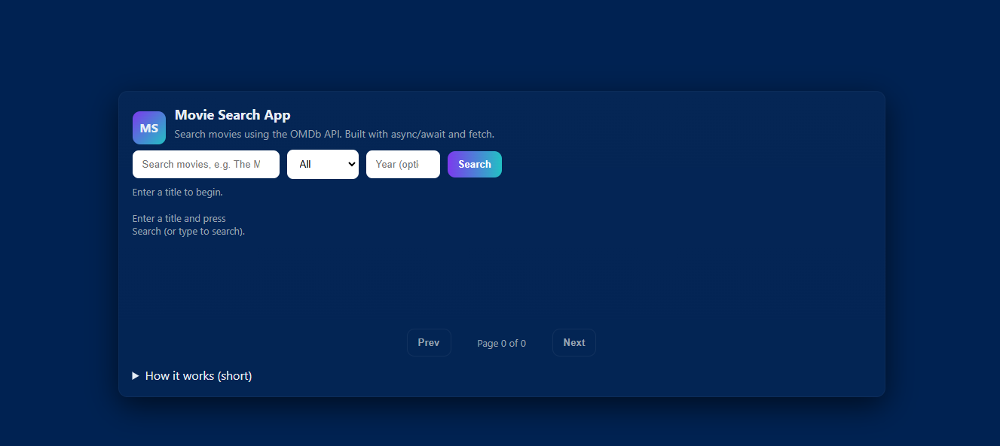

# 🎬 Movie Search App

🚀 A sleek and interactive movie search application that allows users to explore movies, series, and episodes in real-time using the OMDb API.

Designed with a clean UI and smooth user experience, this project demonstrates strong fundamentals of **JavaScript, API handling, and responsive design**.

---

## 🌐 Live Demo

👉 https://ayush765497.github.io/Movie-search-app/

---

## 🧠 Project Overview

This app lets users search for movies dynamically and fetches real-time data from an external API. It focuses on **performance, usability, and clean UI design**.

Instead of static content, everything is dynamically rendered — making it closer to real-world frontend applications.

---

## ✨ Key Features

🔍 **Instant Search Experience**

* Search movies as you type (debounced input)

🎭 **Smart Filters**

* Filter by type: Movie / Series / Episode
* Filter by release year

📄 **Pagination Support**

* Navigate through multiple pages of results seamlessly

🎬 **Interactive Cards**

* Clean movie cards with poster, title, and details
* Click → redirects to IMDb

⚡ **Fast & Responsive UI**

* Works smoothly across devices
* Minimal and modern design

---

## 🛠️ Tech Stack

| Technology        | Purpose              |
| ----------------- | -------------------- |
| HTML5             | Structure            |
| CSS3              | Styling & Layout     |
| JavaScript (ES6+) | Logic & API handling |
| OMDb API          | Movie data           |

---

## ⚙️ How It Works

1. User enters a movie name
2. App sends request to OMDb API
3. Data is fetched using `fetch` + `async/await`
4. Results are dynamically rendered on UI
5. Pagination handled via API response

---

## 📸 Screenshots

<p align="center">
  
</p>

---

## 📦 Getting Started

Clone the repository:

```bash
git clone https://github.com/Ayush765497/Movie-search-app.git
```

Navigate into project:

```bash
cd Movie-search-app
```

Run the app:

* Open `index.html` in your browser

---

## 🔑 API Setup

* Get your free API key from: http://www.omdbapi.com/

Update in `script.js`:

```js
const API_KEY = 'YOUR_API_KEY';
```

---

## 🚀 Future Improvements

* 🌙 Dark / Light mode toggle
* ❤️ Add to favorites / watchlist
* 📊 Detailed movie info page
* 🎞️ Trailer integration
* 🔎 Better search suggestions

---

## 💡 What I Learned

* Working with real-world APIs
* Handling async operations in JavaScript
* Managing UI state (loading, errors, results)
* Building responsive layouts

---

## 👨‍💻 Author

**Ayush Kumar**

---

## ⭐ Support

If you found this project useful, consider giving it a ⭐ on GitHub — it really helps!

---

## 📌 Note

This project is part of my continuous learning journey to improve frontend development and build real-world applications.
